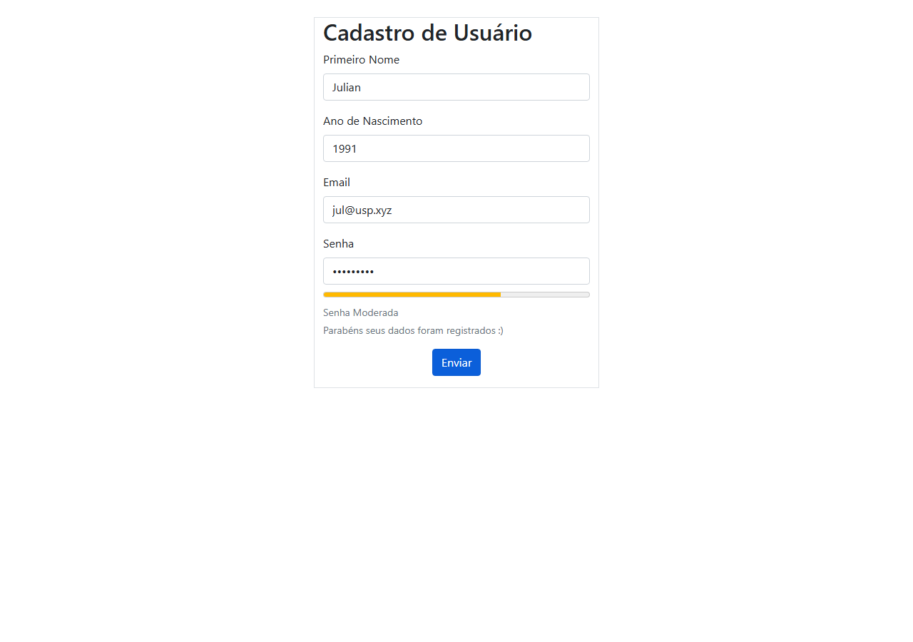
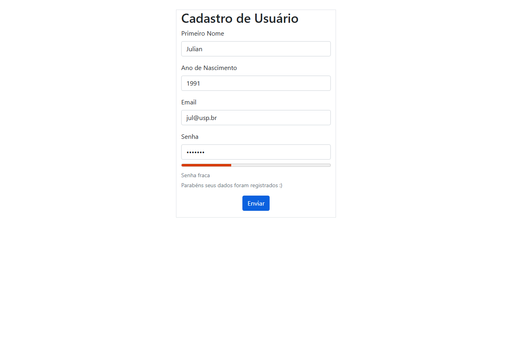

# Relatório de Teste Combinatorial com Selenium IDE

**Disciplina:** Desenvolvimento Web e Mobile (SSC0961) - ICMC-USP  
**Estudante:** Rafael Feltrim  
**Interface Testada:** [Cadastro de Usuário](https://linamgr.github.io/cadastro-usuario/)  
**Revisão QA SDET:** Rafael QA SR SDET - Feltrim Agents Base  
**Atualizado em:** 08/06/2026 22:00

## Parecer de Conformidade

A entrega original não estava 100% aderente ao enunciado porque o arquivo `.side` continha apenas 6 testes automatizados: CT1-1, CT1-2, CT2-1, CT2-2, CT2-3 e CT32-1. O enunciado pede a suíte Selenium completada com os novos casos de teste até CT32.

Nesta revisão, a suíte Selenium foi completada com 35 testes executáveis, cobrindo os 32 casos combinatoriais funcionais: CT1 possui 2 representantes, CT2 possui 3 representantes conforme exemplos da professora, e CT3 a CT32 possuem 1 representante cada.

## Checklist Oficial do Enunciado

| Requisito | Status | Evidência |
|---|---|---|
| Documento com tabela preenchida com 32 casos | ATENDE | Seção 1 deste relatório |
| Saída esperada e saída obtida por caso | ATENDE | Colunas `Saída Esperada` e `Saída Obtida` |
| Relatório dos erros encontrados | ATENDE | Seção 2 deste relatório |
| Link da interface testada | ATENDE | Seção 3 deste relatório |
| Arquivo `.side` com novos casos implementados | ATENDE | `cadastro-usuario-testes-rafaelfeltrim.side` com 35 testes |
| Nome do estudante no arquivo `.side` | ATENDE | Nome do arquivo inclui `rafaelfeltrim` |
| Arquivo zipado com todos os artefatos | ATENDE | `cadastro-usuario-testes-rafaelfeltrim.zip` recriado |

## 1. Tabela de Casos de Teste Combinatoriais (32 Cenários)

A matriz considera 5 fatores binários para fechar 2^5 combinações: Nome, Ano de Nascimento, Email, Senha por Estrutura e Senha por Restrição (não conter nome/ano).

| ID | Nome | Ano | Email | Senha Estrutura | Senha Restrição | Saída Esperada | Saída Obtida (Real) | Status | Representante(s) |
|---|---|---|---|---|---|---|---|---|---|
| CT1 | Válido | Válido | Válido | Válida | Não contém | Cadastro válido | Senha: Senha Moderada / Resultado: Parabéns seus dados foram registrados :) | PASS | 1: nome='Julian', ano=1991, email=jul@usp.br, senha='#@49%No74'; 2: nome='Maria Aparecida Lucinda Ferreiras', ano=1991, email=malf@usp.br, senha='#@49%No74' |
| CT2 | Inválido | Válido | Válido | Válida | Não contém | Nome | Senha: Senha Moderada / Resultado: Parabéns seus dados foram registrados :) | FAIL | 1: nome='M@r1a', ano=1991, email=maria@usp.br, senha='#@49%No74'; 2: nome='MariaAparecidaLucindadeFerreira', ano=1991, email=maria@usp.br, senha='#@49%No74'; 3: nome='   ', ano=1991, email=maria@usp.br, senha='#@49%No74' |
| CT3 | Válido | Inválido | Válido | Válida | Não contém | Ano | Senha: Senha Moderada / Resultado: Parabéns seus dados foram registrados :) | FAIL | 1: nome='Julian', ano=2035, email=jul@usp.br, senha='#@49%No74' |
| CT4 | Válido | Válido | Inválido | Válida | Não contém | Email | Senha: Senha Moderada / Resultado: Parabéns seus dados foram registrados :) | FAIL | 1: nome='Julian', ano=1991, email=jul@usp.xyz, senha='#@49%No74' |
| CT5 | Válido | Válido | Válido | Inválida | Não contém | Senha | Senha: Senha inválida! / Resultado: Seus dados não foram registrados :( | PASS com ressalva de mensagem | 1: nome='Julian', ano=1991, email=jul@usp.br, senha='12345' |
| CT6 | Válido | Válido | Válido | Válida | Contém nome/ano | Senha | Senha: Senha inválida! / Resultado: Seus dados não foram registrados :( | PASS com ressalva de mensagem | 1: nome='Julian', ano=1991, email=jul@usp.br, senha='#@49%Julian74' |
| CT7 | Válido | Válido | Válido | Inválida | Contém nome/ano | Senha | Senha: Senha inválida! / Resultado: Seus dados não foram registrados :( | PASS com ressalva de mensagem | 1: nome='Julian', ano=1991, email=jul@usp.br, senha='1991' |
| CT8 | Válido | Válido | Inválido | Válida | Contém nome/ano | Email, Senha | Senha: Senha inválida! / Resultado: Seus dados não foram registrados :( | FAIL | 1: nome='Julian', ano=1991, email=jul@usp.xyz, senha='#@49%Julian74' |
| CT9 | Válido | Válido | Inválido | Inválida | Não contém | Email, Senha | Senha: Senha inválida! / Resultado: Seus dados não foram registrados :( | FAIL | 1: nome='Julian', ano=1991, email=jul@usp.xyz, senha='12345' |
| CT10 | Válido | Inválido | Válido | Válida | Contém nome/ano | Ano, Senha | Senha: Senha inválida! / Resultado: Seus dados não foram registrados :( | FAIL | 1: nome='Julian', ano=2035, email=jul@usp.br, senha='#@49%Julian74' |
| CT11 | Válido | Inválido | Válido | Inválida | Não contém | Ano, Senha | Senha: Senha inválida! / Resultado: Seus dados não foram registrados :( | FAIL | 1: nome='Julian', ano=2035, email=jul@usp.br, senha='12345' |
| CT12 | Válido | Inválido | Inválido | Válida | Não contém | Ano, Email | Senha: Senha Moderada / Resultado: Parabéns seus dados foram registrados :) | FAIL | 1: nome='Julian', ano=2035, email=jul@usp.xyz, senha='#@49%No74' |
| CT13 | Inválido | Válido | Válido | Válida | Contém nome/ano | Nome, Senha | Senha: Senha inválida! / Resultado: Seus dados não foram registrados :( | FAIL | 1: nome='M@r1a', ano=1991, email=jul@usp.br, senha='#@49%M@r1a74' |
| CT14 | Inválido | Válido | Válido | Inválida | Não contém | Nome, Senha | Senha: Senha inválida! / Resultado: Seus dados não foram registrados :( | FAIL | 1: nome='M@r1a', ano=1991, email=jul@usp.br, senha='12345' |
| CT15 | Inválido | Válido | Inválido | Válida | Não contém | Nome, Email | Senha: Senha Moderada / Resultado: Parabéns seus dados foram registrados :) | FAIL | 1: nome='M@r1a', ano=1991, email=jul@usp.xyz, senha='#@49%No74' |
| CT16 | Inválido | Inválido | Válido | Válida | Não contém | Nome, Ano | Senha: Senha Moderada / Resultado: Parabéns seus dados foram registrados :) | FAIL | 1: nome='M@r1a', ano=2035, email=jul@usp.br, senha='#@49%No74' |
| CT17 | Válido | Válido | Inválido | Inválida | Contém nome/ano | Email, Senha | Senha: Senha inválida! / Resultado: Seus dados não foram registrados :( | FAIL | 1: nome='Julian', ano=1991, email=jul@usp.xyz, senha='1991' |
| CT18 | Válido | Inválido | Válido | Inválida | Contém nome/ano | Ano, Senha | Senha: Senha inválida! / Resultado: Seus dados não foram registrados :( | FAIL | 1: nome='Julian', ano=2035, email=jul@usp.br, senha='2035' |
| CT19 | Válido | Inválido | Inválido | Válida | Contém nome/ano | Ano, Email, Senha | Senha: Senha inválida! / Resultado: Seus dados não foram registrados :( | FAIL | 1: nome='Julian', ano=2035, email=jul@usp.xyz, senha='#@49%Julian74' |
| CT20 | Válido | Inválido | Inválido | Inválida | Não contém | Ano, Email, Senha | Senha: Senha inválida! / Resultado: Seus dados não foram registrados :( | FAIL | 1: nome='Julian', ano=2035, email=jul@usp.xyz, senha='12345' |
| CT21 | Inválido | Válido | Válido | Inválida | Contém nome/ano | Nome, Senha | Senha: Senha inválida! / Resultado: Seus dados não foram registrados :( | FAIL | 1: nome='M@r1a', ano=1991, email=jul@usp.br, senha='1991' |
| CT22 | Inválido | Válido | Inválido | Válida | Contém nome/ano | Nome, Email, Senha | Senha: Senha inválida! / Resultado: Seus dados não foram registrados :( | FAIL | 1: nome='M@r1a', ano=1991, email=jul@usp.xyz, senha='#@49%M@r1a74' |
| CT23 | Inválido | Válido | Inválido | Inválida | Não contém | Nome, Email, Senha | Senha: Senha inválida! / Resultado: Seus dados não foram registrados :( | FAIL | 1: nome='M@r1a', ano=1991, email=jul@usp.xyz, senha='12345' |
| CT24 | Inválido | Inválido | Válido | Válida | Contém nome/ano | Nome, Ano, Senha | Senha: Senha inválida! / Resultado: Seus dados não foram registrados :( | FAIL | 1: nome='M@r1a', ano=2035, email=jul@usp.br, senha='#@49%M@r1a74' |
| CT25 | Inválido | Inválido | Válido | Inválida | Não contém | Nome, Ano, Senha | Senha: Senha inválida! / Resultado: Seus dados não foram registrados :( | FAIL | 1: nome='M@r1a', ano=2035, email=jul@usp.br, senha='12345' |
| CT26 | Inválido | Inválido | Inválido | Válida | Não contém | Nome, Ano, Email | Senha: Senha Moderada / Resultado: Parabéns seus dados foram registrados :) | FAIL | 1: nome='M@r1a', ano=2035, email=jul@usp.xyz, senha='#@49%No74' |
| CT27 | Válido | Inválido | Inválido | Inválida | Contém nome/ano | Ano, Email, Senha | Senha: Senha inválida! / Resultado: Seus dados não foram registrados :( | FAIL | 1: nome='Julian', ano=2035, email=jul@usp.xyz, senha='2035' |
| CT28 | Inválido | Válido | Inválido | Inválida | Contém nome/ano | Nome, Email, Senha | Senha: Senha inválida! / Resultado: Seus dados não foram registrados :( | FAIL | 1: nome='M@r1a', ano=1991, email=jul@usp.xyz, senha='1991' |
| CT29 | Inválido | Inválido | Válido | Inválida | Contém nome/ano | Nome, Ano, Senha | Senha: Senha inválida! / Resultado: Seus dados não foram registrados :( | FAIL | 1: nome='M@r1a', ano=2035, email=jul@usp.br, senha='2035' |
| CT30 | Inválido | Inválido | Inválido | Válida | Contém nome/ano | Nome, Ano, Email, Senha | Senha: Senha inválida! / Resultado: Seus dados não foram registrados :( | FAIL | 1: nome='M@r1a', ano=2035, email=jul@usp.xyz, senha='#@49%M@r1a74' |
| CT31 | Inválido | Inválido | Inválido | Inválida | Não contém | Nome, Ano, Email, Senha | Senha: Senha inválida! / Resultado: Seus dados não foram registrados :( | FAIL | 1: nome='M@r1a', ano=2035, email=jul@usp.xyz, senha='12345' |
| CT32 | Inválido | Inválido | Inválido | Inválida | Contém nome/ano | Nome, Ano, Email, Senha | Email: Endereço de e-mail incorreto! / Senha: Senha inválida! / Resultado: Seus dados não foram registrados :( | FAIL | 1: nome='M@r1a', ano=2035, email=mariausp.br, senha='2035' |

## 2. Relatório Técnico de Defeitos

### Bug 01: Ausência de validação de nome (`validateFields.js`)

- **Regra esperada:** nome deve conter apenas letras e comprimento maior ou igual a 6; caso contrário, retornar `Nome inválido.`.
- **Comportamento observado:** nomes como `M@r1a` são aceitos e o cadastro é registrado.
- **Causa provável:** `validateFields.js` lê `inputName`, mas não valida nem escreve em `#inputNameHelp`.
- **BDD:** Dado que preencho o nome `M@r1a` e os demais campos válidos, quando envio o cadastro, então o sistema deve exibir `Nome inválido.` e não registrar os dados.

### Bug 02: Validação de ano desativada (`validarAno.js`)

- **Regra esperada:** ano de nascimento deve estar dentro dos últimos 120 anos e não ser futuro.
- **Comportamento observado:** o ano `2035` é aceito e o cadastro é registrado.
- **Causa provável:** a lógica de validação está comentada e a função retorna `true` incondicionalmente.
- **BDD:** Dado que preencho o ano `2035`, quando envio o cadastro, então o sistema deve exibir `Ano inválido.` e não registrar os dados.

### Bug 03: Regex de email não restringe TLD (`validarEmail.js`)

- **Regra esperada:** email deve finalizar em `br`, `com`, `net` ou `org`.
- **Comportamento observado:** `jul@usp.xyz` é aceito e o cadastro é registrado.
- **Causa provável:** a regex aceita qualquer sufixo alfabético, como `.xyz`.
- **BDD:** Dado que preencho o email `jul@usp.xyz`, quando envio o cadastro, então o sistema deve exibir `Formato de email inválido.` e não registrar os dados.

### Bug 04: Mensagens da interface divergem da especificação

- **Regra esperada:** `Formato de email inválido.`, `Senha inválida.`, `Seus dados foram registrados` e `Seus dados não foram registrados`.
- **Comportamento observado:** a interface usa `Endereço de e-mail incorreto!`, `Senha inválida!`, `Parabéns seus dados foram registrados :)` e `Seus dados não foram registrados :(`.
- **Impacto:** a lógica funcional pode até bloquear alguns cenários, mas as mensagens não cumprem o texto solicitado no enunciado.

### Bug 05: Senha com exatamente 8 caracteres cai em classificação não especificada

- **Regra esperada:** senha fraca tem comprimento menor que 8; senha moderada tem mais de 8. O enunciado não define claramente o limite exato de 8 caracteres.
- **Comportamento observado:** a senha `#@49%N7` (8 caracteres) é aceita, classificada como `Senha fraca` e registra o cadastro.
- **Classificação QA:** nuance/risco de especificação. Se a professora cobrar interpretação estrita, este ponto deve ser reportado.

## 3. Link da Interface Testada

- https://linamgr.github.io/cadastro-usuario/

## 4. Suíte Selenium IDE

- **Arquivo:** `cadastro-usuario-testes-rafaelfeltrim.side`
- **Total de testes automatizados:** 35
- **Cobertura:** 32 combinações funcionais, preservando múltiplos representantes de CT1 e CT2 do enunciado.
- **Comandos usados para entrada:** `type`, para disparar eventos reais da interface em vez de preencher campos por `executeScript`.
- **Testes incluídos:** cadastro-usuario-ct1-1, cadastro-usuario-ct1-2, cadastro-usuario-ct2-1, cadastro-usuario-ct2-2, cadastro-usuario-ct2-3, cadastro-usuario-ct3-1, cadastro-usuario-ct4-1, cadastro-usuario-ct5-1, cadastro-usuario-ct6-1, cadastro-usuario-ct7-1, cadastro-usuario-ct8-1, cadastro-usuario-ct9-1, cadastro-usuario-ct10-1, cadastro-usuario-ct11-1, cadastro-usuario-ct12-1, cadastro-usuario-ct13-1, cadastro-usuario-ct14-1, cadastro-usuario-ct15-1, cadastro-usuario-ct16-1, cadastro-usuario-ct17-1, cadastro-usuario-ct18-1, cadastro-usuario-ct19-1, cadastro-usuario-ct20-1, cadastro-usuario-ct21-1, cadastro-usuario-ct22-1, cadastro-usuario-ct23-1, cadastro-usuario-ct24-1, cadastro-usuario-ct25-1, cadastro-usuario-ct26-1, cadastro-usuario-ct27-1, cadastro-usuario-ct28-1, cadastro-usuario-ct29-1, cadastro-usuario-ct30-1, cadastro-usuario-ct31-1, cadastro-usuario-ct32-1

## 5. Evidências Visuais

As evidências originais foram mantidas na pasta `evidencias/`. Além disso, foram adicionadas capturas Playwright com reprodução direta dos principais defeitos:

### Evidência Playwright - bug ano futuro

### Evidência Playwright - bug email tld

### Evidência Playwright - bug nome invalido

### Evidência Playwright - bug senha 8

## 6. Parecer Final do Agente

**Antes da revisão:** não estava 100% de acordo com o que a professora pediu, principalmente pela suíte `.side` incompleta.

**Após esta atualização:** o pacote passa a atender os requisitos estruturais de entrega: documento, tabela, relatório de bugs, link, `.side` completo e ZIP final. A interface testada continua apresentando bugs reais, que estão documentados como resultado da atividade.
