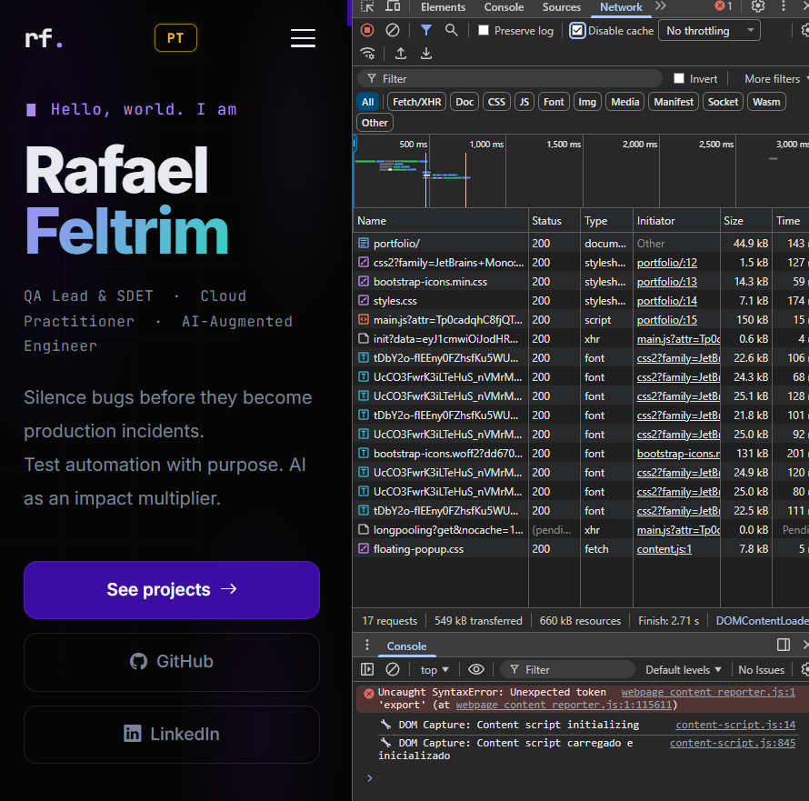
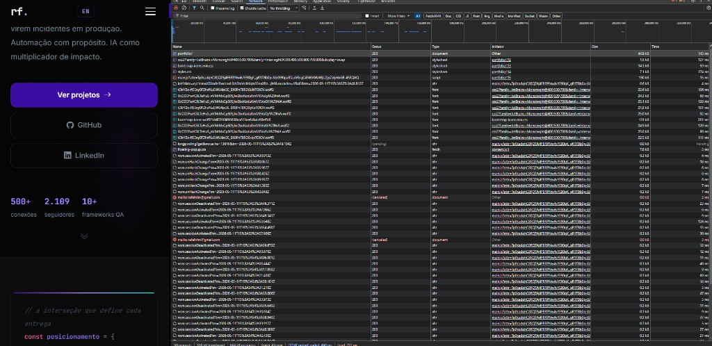
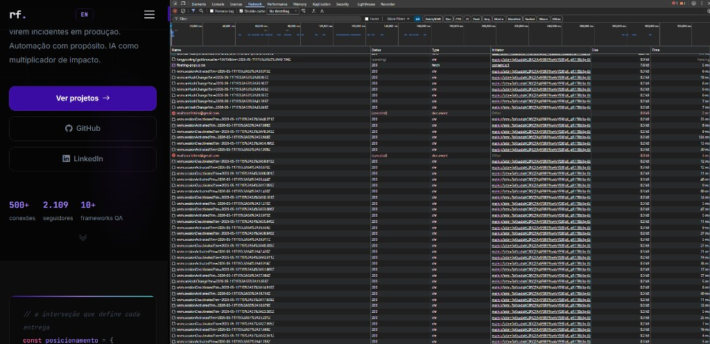

# Atividade 2 - Inspeção de Tráfego de Rede com DevTools

**Aluno:** Rafael Feltrim - Nº USP: 15942812
**Disciplina:** SSC0961 - Desenvolvimento Web e Mobile (USP)

---

## 1. O que é a aba Network (Rede) do DevTools

O DevTools (Ferramentas do Desenvolvedor) do Google Chrome é um conjunto de ferramentas integradas ao navegador que permite inspecionar, depurar e analisar páginas web. Para acessá-lo, basta pressionar **F12** ou **Ctrl+Shift+I** (Windows/Linux) em qualquer página.

A aba **Network** (Rede) registra todas as requisições HTTP que o navegador faz ao carregar uma página. Ela mostra cada recurso baixado, o tempo de carregamento, o tamanho e o código de status HTTP. É uma ferramenta essencial para entender o que acontece nos bastidores quando um site é aberto.

---

## 2. Como usar a aba Network

1. Abra o Google Chrome e navegue até o site que deseja inspecionar.
2. Pressione **F12** para abrir o DevTools.
3. Clique na aba **Network** (ou **Rede**, se o Chrome estiver em português).
4. Recarregue a página com **Ctrl+R** ou **F5** para capturar todo o tráfego desde o início.
5. Observe a lista de requisições que aparece na parte inferior da tela.

**Dica:** Marque a opção **"Disable cache"** (Desabilitar cache) no topo da aba Network para forçar o navegador a baixar todos os recursos novamente, simulando a experiência de um primeiro acesso.

---

## 3. Tipos de recursos carregados

Ao abrir qualquer página web, o navegador faz dezenas (ou centenas) de requisições. Os principais tipos de recursos são:

### 3.1 Document (Documento HTML)

O primeiro recurso carregado é o documento HTML principal da página. Ele contém a estrutura completa do conteúdo e referências a outros recursos (CSS, JS, imagens).

- **Método HTTP:** GET
- **Tipo no DevTools:** `document`
- **Exemplo:** `GET https://www.exemplo.com/` → retorna o `index.html`

### 3.2 Stylesheet (Folhas de Estilo CSS)

Arquivos `.css` que definem a aparência visual da página (cores, fontes, layout).

- **Tipo no DevTools:** `stylesheet`
- **Exemplo:** `styles.css`, `bootstrap.min.css`

### 3.3 Script (JavaScript)

Arquivos `.js` que adicionam interatividade e comportamento dinâmico à página.

- **Tipo no DevTools:** `script`
- **Exemplo:** `app.js`, `analytics.js`, `react.production.min.js`

### 3.4 XHR / Fetch (Requisições Assíncronas)

Requisições feitas pelo JavaScript da página para buscar dados sem recarregar a página inteira. São muito comuns em aplicações modernas (SPAs) que carregam conteúdo dinamicamente.

- **Tipo no DevTools:** `xhr` ou `fetch`
- **Exemplo:** `GET /api/noticias` retornando dados em JSON

### 3.5 Img (Imagens)

Arquivos de imagem como `.png`, `.jpg`, `.svg`, `.webp`.

- **Tipo no DevTools:** `img`
- **Exemplo:** `logo.svg`, `banner-home.webp`

### 3.6 Font (Fontes)

Arquivos de tipografia como `.woff2`, `.ttf` carregados via `@font-face` no CSS.

- **Tipo no DevTools:** `font`
- **Exemplo:** `Manrope-Regular.woff2`

### 3.7 Media (Áudio e Vídeo)

Arquivos de mídia como `.mp4`, `.mp3`, `.webm`.

- **Tipo no DevTools:** `media`

### 3.8 Manifest / Service Worker

Arquivos usados em Progressive Web Apps (PWAs) para habilitar funcionalidades offline.

- **Tipo no DevTools:** `manifest`

---

## 4. Códigos de Status HTTP

Cada requisição na aba Network mostra um código de status na coluna **Status**. Esses códigos indicam o resultado da comunicação entre o navegador e o servidor:

### Respostas de sucesso (2xx)

| Código | Significado | Descrição |
| --- | --- | --- |
| **200** | OK | A requisição foi bem-sucedida. O recurso foi encontrado e enviado. |
| **201** | Created | Um novo recurso foi criado com sucesso (comum em requisições POST). |
| **204** | No Content | A requisição foi bem-sucedida, mas não há conteúdo para retornar. |

### Redirecionamentos (3xx)

| Código | Significado | Descrição |
| --- | --- | --- |
| **301** | Moved Permanently | O recurso mudou de URL permanentemente. |
| **302** | Found | Redirecionamento temporário. |
| **304** | Not Modified | O recurso não foi alterado desde a última visita (usa cache local). |

### Erros do cliente (4xx)

| Código | Significado | Descrição |
| --- | --- | --- |
| **400** | Bad Request | A requisição está malformada ou inválida. |
| **401** | Unauthorized | É necessário autenticação para acessar o recurso. |
| **403** | Forbidden | O servidor entendeu a requisição, mas se recusa a autorizá-la. |
| **404** | Not Found | O recurso solicitado não existe no servidor. |

### Erros do servidor (5xx)

| Código | Significado | Descrição |
| --- | --- | --- |
| **500** | Internal Server Error | Erro genérico no servidor. |
| **502** | Bad Gateway | O servidor atuando como gateway recebeu resposta inválida. |
| **503** | Service Unavailable | O servidor está temporariamente indisponível (manutenção ou sobrecarga). |

---

## 5. Informações da linha do tempo (Timing)

Ao clicar em uma requisição e ir na aba **Timing**, é possível ver as fases do carregamento:

- **Queueing:** tempo que a requisição ficou na fila esperando para ser enviada.
- **DNS Lookup:** tempo para resolver o nome de domínio em endereço IP.
- **Initial connection / SSL:** tempo para estabelecer a conexão TCP e negociar o certificado HTTPS.
- **Request sent:** tempo para enviar a requisição ao servidor.
- **Waiting (TTFB):** *Time to First Byte* — tempo entre o envio da requisição e o recebimento do primeiro byte da resposta. É a métrica mais importante para medir a velocidade do servidor.
- **Content Download:** tempo para baixar o corpo completo da resposta.

---

## 6. Barra de resumo (rodapé da aba Network)

Na parte inferior da aba Network, há um resumo geral que indica:

- **Quantidade de requisições:** quantos recursos foram carregados ao todo.
- **Tamanho transferido:** quantidade total de dados baixados pela rede (comprimidos com gzip/brotli).
- **Tamanho dos recursos:** tamanho real dos arquivos após descompressão.
- **Tempo total (Finish):** tempo total até a última requisição ser concluída.
- **DOMContentLoaded:** momento em que o HTML foi completamente parseado.
- **Load:** momento em que todos os recursos (incluindo imagens e CSS) terminaram de carregar.

---

## 7. Capturas de tela da inspeção

### 7.1 Visão geral da aba Network

**Descrição:** Esta captura mostra todas as requisições realizadas pelo navegador ao carregar a página principal do site. Note a coluna "Name" com os nomes dos arquivos, "Status" com os códigos HTTP, "Type" com o tipo do recurso, "Size" com o tamanho e "Time" com o tempo de carregamento individual.

---

### 7.2 Detalhes de uma requisição específica (Document)

**Descrição:** A primeira requisição da lista é o documento principal `portfolio/`, carregado por `GET` com status `200 OK`. O arquivo HAR exportado junto com a atividade (`prints/rafeltrim.github.io.har`) preserva os metadados técnicos dessa requisição, incluindo URL, método, status, protocolo HTTP/2 e cabeçalhos.

---

### 7.3 Requisições XHR/Fetch (se houver)

**Descrição:** O portfólio é uma página estática hospedada no GitHub Pages e não depende de uma API própria para renderizar o conteúdo principal. As requisições XHR observadas no HAR aparecem associadas a recursos do navegador/extensões e eventos de sessão, não a uma API funcional do portfólio.

---

### 7.4 Barra de resumo e linha do tempo

**Descrição:** A barra inferior resume o carregamento total: quantidade de requisições, dados transferidos, tempo até DOMContentLoaded e tempo até Load completo.

---

## 8. Análise do tráfego observado

**Site inspecionado:** Portfólio Rafael Feltrim - GitHub Pages  
**URL:** <https://rafeltrim.github.io/portfolio/>  
**Arquivo HAR utilizado como evidência:** `prints/rafeltrim.github.io.har`

**Observações:**

1. **Total de requisições:** a captura principal mostra 17 requisições no carregamento inicial da página. O HAR exportado contém 54 entradas porque também registrou interações/eventos posteriores durante a inspeção.
2. **Tamanho total transferido:** a barra inferior do DevTools mostra aproximadamente 549 kB transferidos e 660 kB de recursos.
3. **Tempo de carregamento:** a captura mostra `Finish` em aproximadamente 2,71 s. No HAR, o `DOMContentLoaded` foi registrado em aproximadamente 460 ms e o evento `Load` em aproximadamente 722 ms.
4. **Recursos mais pesados:** os maiores recursos observados foram o script `main.js` (~150 kB), a fonte `bootstrap-icons.woff2` (~131 kB), folhas de estilo e fontes externas carregadas do Google Fonts.
5. **Códigos de status encontrados:** as requisições concluídas no HAR retornaram status `200 OK`, indicando que os recursos foram encontrados e entregues corretamente. Na captura também aparece uma requisição `longpolling` pendente, comum em recursos de sessão/extensão durante a navegação.
6. **Requisições XHR/Fetch:** não foram identificadas chamadas a uma API própria do portfólio para montar a página. As entradas XHR/Fetch observadas estão associadas a eventos auxiliares do ambiente de navegação, como sessão/long polling, e não ao conteúdo principal do site.
7. **Fontes externas:** houve carregamento de fontes externas do Google Fonts (`Inter` e `JetBrains Mono`) e dos ícones do Bootstrap via CDN (`bootstrap-icons`).

---

## Referências

- Google Chrome DevTools - Network Reference. Disponível em: <https://developer.chrome.com/docs/devtools/network/reference>
- MDN Web Docs - HTTP Status Codes. Disponível em: <https://developer.mozilla.org/pt-BR/docs/Web/HTTP/Status>
- Google Chrome DevTools - Inspect Network Activity. Disponível em: <https://developer.chrome.com/docs/devtools/network>
