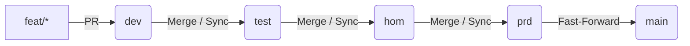

# Diretrizes de Governança: Fluxo de Branches e Commits

Este documento define os padrões organizacionais e técnicos para a gestão de branches, versionamento de código e fluxo de integração contínua na Rede Municipal de Bibliotecas de São Carlos (**SIBiSC**).

---

## 1. Regra Central de Contribuição

> [!IMPORTANT]
> **Nenhum desenvolvedor realiza commits diretamente nas branches de ambiente (`main`, `dev`, `test`, `hom`, `prd`).**
> Todo código novo deve ser originado em uma branch de trabalho secundária (`feat/*`, `fix/*`, etc.) a partir da branch `dev`, e integrado exclusivamente por meio de Pull Requests aprovados.

---

## 2. Topologia das Branches de Ambiente

O projeto SIBiSC é estruturado em **5 branches de ambiente permanentes e protegidas**, mapeando o ciclo de entrega de software de ponta a ponta:



| Branch | Escopo e Responsabilidade | Permissões de Integração |
| :--- | :--- | :--- |
| **`dev`** | **Integração de Features:** Ambiente de desenvolvimento onde todas as novas funcionalidades são unificadas. | Aberto a Pull Requests (PR) de todos os desenvolvedores. |
| **`test`** | **Validação de QA (Testes):** Branch em que a equipe de QA realiza testes exploratórios, testes funcionais e auditorias. | Apenas Tech Lead (TL) ou QA Lead integram após validação primária. |
| **`hom`** | **Homologação e Staging:** Branch que serve de espelho para testes de aceitação do usuário final e homologação da disciplina. | Restrito a aprovação do QA Lead / Rafael. |
| **`prd`** | **Versão de Produção Habilitada:** Branch que hospeda o código pronto e empacotado para o deploy de produção do MVP. | Exclusivo para liberação de Releases controladas. |
| **`main`** | **Espelho de Integração Inicial:** Branch principal do repositório, mantida em sincronia estável com a `prd` para onboarding rápido. | Sincronia automatizada via pipeline de CI. |

---

## 3. Padrão de Nomenclatura para Branches de Trabalho

Todas as branches temporárias criadas para atuar em cards do Jira devem seguir rigorosamente o padrão:

```text
<tipo>/<ID-Jira>-<breve-descricao-hifenizada>
```

### Tipos Válidos (`<tipo>`)
* **`feat/`**: Para novas funcionalidades ou melhorias de escopo.
* **`fix/`**: Para correção de bugs e problemas de layout.
* **`docs/`**: Para alterações exclusivas em documentações técnica ou de processo.
* **`chore/`**: Para atualizações de dependências, configurações ou scripts de infraestrutura.
* **`test/`**: Para criação ou modificação exclusiva de arquivos de testes.
* **`release/`**: Para preparação final de versão e builds nativos do Capacitor.

### Exemplos Práticos
* `feat/US-ACV-003-identificar-unidade-mais-proxima`
* `fix/T-BASE-004-correcao-footer-cutoff`
* `docs/T-QA-004-atualizar-relatorio-final`
* `chore/T-BASE-002-configurar-dependencias-capacitor`

---

## 4. Padrão de Commits (Conventional Commits)

Os commits devem ser atômicos, representando uma única unidade de progresso lógico, e estruturados conforme o padrão:

```text
tipo(escopo): resumo conciso em português ou inglês
```

### Exemplos Recomendados
* `feat(catalog): add nearest unit distance calculation`
* `fix(layout): adjust mobile footer safe-area padding`
* `docs(governance): restructure branch workflow guides`
* `chore(deps): update capacitor android core dependencies`

### Ritmo de Commits
* **Comite Cedo, Comite Sempre:** Não acumule um dia inteiro de modificações em um único commit gigante.
* **Foco Atômico:** Evite misturar alterações de estilos de tela com ajustes de arquivos de pipeline no mesmo commit.

---

## 5. Fluxo de Trabalho Passo a Passo (Do Início ao PR)

Para contribuir de maneira organizada, siga o fluxo de etapas:

1. **Atualize a base local:**
   ```bash
   git checkout dev
   git pull origin dev
   ```
2. **Crie a branch do card correspondente:**
   ```bash
   git checkout -b feat/T-XXX-nome-da-sua-tarefa
   ```
3. **Desenvolva e realize commits atômicos:**
   Realize commits explicativos conforme as entregas locais forem refinadas.
4. **Valide localmente antes de subir:**
   ```bash
   cd SIBiSC
   npm run qa:ci
   ```
5. **Envie a branch para o remoto:**
   ```bash
   git push origin feat/T-XXX-nome-da-sua-tarefa
   ```
6. **Abra o Pull Request para `dev`:**
   * Preencha o template de Pull Request (`PULL_REQUEST_TEMPLATE.md`).
   * Adicione o card do Jira relacionado.
   * Aguarde a aprovação do revisor e o sucesso das validações do pipeline de CI.
